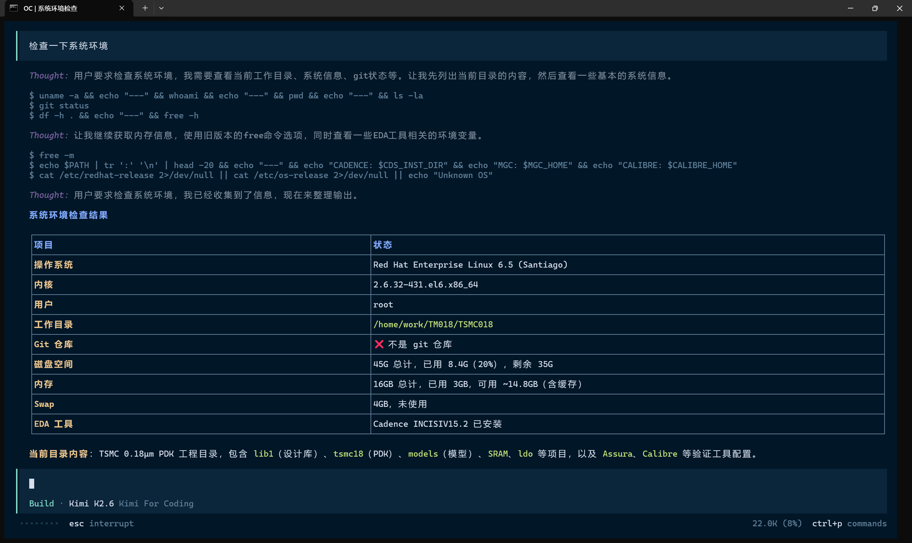

# 🌐 Remote Code

[中文](README.zh-CN.md)

An OpenCode plugin that lets AI agents operate remote machines over SSH — with **zero footprint** on the remote side. The remote machine only needs `sshd`; no agent, runtime, or dependency installation is required.

The AI sees nothing different: it still calls `bash`, `edit`, `write`, `read`, `glob`, `grep`, and `apply_patch` exactly as it would locally.

---

## 💡 Why Remote Code?

I am an analog IC engineer. My daily work relies on the **Cadence IC6.1.7 design suite**, which runs on an aging **CentOS 6 VM**. The glibc version on CentOS 6 is too old to install any modern agent tools — Node.js, Python 3.11+, and most modern CLI tools simply won't run.

I need to use OpenCode on my local Windows host to control that VM — automating design flows, batch-modifying schematic parameters, running simulation scripts. **Remote Code** makes this possible: the AI thinks it is operating local files, but every command actually executes on that ancient VM.



**Not a single file needs to be touched on the VM — only the SSH service must be running.**

| Scenario                      | Pain Point                               | Remote Code Solution            |
| :---------------------------- | :--------------------------------------- | :------------------------------ |
| Legacy VMs (CentOS 6, RHEL 5) | Cannot install modern agents             | Only needs SSH                  |
| Production servers            | Strict compliance, no installs           | Leaves no trace on remote       |
| Embedded / edge devices       | No package manager, resource constrained | All logic runs locally          |
| Remote Windows hosts          | Just install OpenSSH                     | Single entry point              |
| Ephemeral containers          | Don't want repeated setup                | Connect on demand, zero residue |

---

## 📋 Prerequisites

- **OpenCode** (latest version)
- **SSH daemon** on the remote machine (the *only* remote requirement)

> **Note**:  This plugin uses the pure-Node.js `ssh2` library internally. You **do not** need to install `ssh`, `sshpass`, or `rsync` locally.

---

## 🚀 Installation

This plugin has external dependencies and requires a build step, so it **must** be installed from source.

```bash
# 1. Download or clone
git clone https://github.com/zz6zz666/opencode-remote-code.git

# 2. Install dependencies and build
cd opencode-remote-code
npm install
npm run build
```

After building, choose one of the following:

### Option A: Copy to OpenCode plugin directory (recommended)

Copy the built plugin into OpenCode's plugin directory so you can delete the original download:

```bash
# Linux/macOS:
cp -r . ~/.config/opencode/plugins/remote-code

# Windows (PowerShell):
Copy-Item -Recurse -Force . $env:USERPROFILE\.config\opencode\plugins\remote-code
```

> OpenCode loads local plugins from `~/.config/opencode/plugins/` (global) or `.opencode/plugins/` (project-level). The directory must contain `package.json` and the built `dist/` folder.

### Option B: Reference the source directly (for development)

Keep the plugin in place and point OpenCode at it:

```json
{
  "plugin": ["/absolute/path/to/opencode-remote-code"]
}
```

Use `npm run dev` for watch-mode builds during development.

---

## 🎯 Usage

Remote mode is activated **exclusively via environment variables**. OpenCode's CLI does not recognize `--remote*` flags, and plugin options in `opencode.json` are unreliable due to internal caching.

### Launcher scripts

The `launchers/` directory contains ready-made launcher scripts for all major platforms. **We strongly recommend using them** because they solve a session persistence problem: OpenCode binds sessions to the current working directory, so if you launch it from different local folders, your remote sessions appear to "disappear." The launchers automatically derive a stable local session directory from your remote target, ensuring sessions persist no matter where you invoke the script from.

1. Copy the appropriate launcher for your platform to a location in your `$PATH` (or keep it anywhere convenient):

   ```bash
   # Linux / macOS
   cp launchers/remote-opencode.sh ~/bin/remote-opencode
   chmod +x ~/bin/remote-opencode

   # Windows PowerShell
   Copy-Item launchers\remote-opencode.ps1 $env:USERPROFILE\bin\remote-opencode.ps1

   # Windows CMD
   copy launchers\remote-opencode.bat %USERPROFILE%\bin\remote-opencode.bat
   ```

2. Edit the **"User Configuration"** block inside the launcher with your `REMOTE_SSH`, `REMOTE_WORKDIR`, and optional credentials.

3. Run the launcher instead of `opencode` directly:

   ```bash
   remote-opencode
   ```

The launcher will:
- Automatically create and `cd` into a stable local session directory (e.g. `~/.opencode/remote-sessions/host_home_project/`)
- Export the required environment variables
- Launch OpenCode from that stable directory

You can also uncomment the optional **SSH connection pool tuning** variables in the launcher if you need to adjust concurrency for legacy SSH servers.

### Configuration options

| Environment Variable       | Description                                                             | Default                  |
| :------------------------- | :---------------------------------------------------------------------- | :----------------------- |
| `REMOTE_SSH`             | Full SSH connection string (exactly as you would type in your terminal) | *(required)*           |
| `REMOTE_WORKDIR`         | Remote working directory (absolute path)                                | *(required)*           |
| `REMOTE_MIRROR`          | Local mirror root directory                                             | `~/.opencode/mirrors/` |
| `REMOTE_PASSWORD`        | SSH login password                                                      | *(optional)*           |
| `REMOTE_SUDO_PASSWORD`   | Sudo password for remote commands                                       | *(optional)*           |
| `REMOTE_POOL_COMMAND_SIZE` | SSH exec connection pool size (`bash`/`glob`/`grep`)                  | `3`                    |
| `REMOTE_POOL_FILE_SIZE`  | SFTP connection pool size (`read`/`write`/`edit`/`patch`)             | `2`                    |
| `REMOTE_POOL_STAGGER_MS` | Delay between sequential SSH handshakes (ms) for legacy servers       | `0`                    |

If `REMOTE_SSH` is not set, the plugin stays dormant and OpenCode runs normally in local mode.

### Authentication examples

**Key-based auth (recommended):**

```bat
set "REMOTE_SSH=ssh -i C:\Users\me\.ssh\id_rsa user@host"
set "REMOTE_WORKDIR=/home/project"
```

**Password auth:**

```bat
set "REMOTE_SSH=ssh user@host"
set "REMOTE_WORKDIR=/home/project"
set "REMOTE_PASSWORD=mypassword"
```

**Sudo commands:**

```bat
set "REMOTE_SSH=ssh user@host"
set "REMOTE_WORKDIR=/app"
set "REMOTE_PASSWORD=mypassword"
set "REMOTE_SUDO_PASSWORD=mysudopass"
```

The AI can then use `sudo` naturally in `bash` commands without interactive prompts.

---

## ⚙️ How It Works

### 1. Local Mirror

Only files the AI actually touches are mirrored locally. The mirror is kept at:

```
~/.opencode/mirrors/
└── user_host/
    └── home_project/
        ├── manifest.json          # tracked file list
        └── home/project/          # mirrored directory tree
            └── src/
                └── main.ts
```

### 2. Path Mapping

All paths visible to the AI are **remote absolute paths**. The plugin translates them transparently:

```
AI sees:     /home/project/src/main.ts
Local path:  ~/.opencode/mirrors/user_host/home_project/home/project/src/main.ts
```

### 3. Sync Engine

File-editing tools (`read`, `write`, `edit`, `apply_patch`) operate on the local mirror and sync via SFTP over persistent SSH connections:

- **Before** a file edit → `pullAll()` ensures the local mirror is up to date
- **After** a file edit → `pushAll()` uploads changes to the remote

Command tools (`bash`, `glob`, `grep`) run directly on the remote via SSH.

### 4. SSH Architecture

The plugin uses the `ssh2` library to maintain connection pools:

- **Command pool** (5 connections): for `bash`, `glob`, `grep` execution
- **File pool** (3 connections): for SFTP file transfers

No external `ssh`, `sshpass`, or `rsync` binaries are required.

---

## 📊 Tool Behavior Matrix

| Tool            | Where it runs | Sync                       | Notes                                                                |
| :-------------- | :------------ | :------------------------- | :------------------------------------------------------------------- |
| `bash`        | Remote SSH    | none                       | Direct shell forwarding                                              |
| `glob`        | Remote SSH    | none                       | Remote `rg --files --sortr=modified` (fallback to `find + stat`) |
| `grep`        | Remote SSH    | none                       | Remote `rg --json` (fallback to `grep -rn`)                      |
| `read`        | Local mirror  | pull before                | Reads from synced mirror                                             |
| `write`       | Local mirror  | pull if exists, push after | Writes to mirror then uploads                                        |
| `edit`        | Local mirror  | pull before, push after    | Exact replacement on mirror                                          |
| `apply_patch` | Local mirror  | pull before, push after    | Applies patch on mirror                                              |

---

## 🔒 Security Boundaries

- **Path containment**: `PathMapper` validates that resolved local paths never escape the mirror root (`../` is rejected).
- **Command safety**: Dynamic arguments to `bash` are passed through SSH without local shell interpolation when possible.
- **Privilege scope**: Remote operations run with the SSH user's permissions — no elevation.
- **Workspace boundary**: Operations outside `REMOTE_WORKDIR` follow OpenCode's native permission confirmation flow.

---

## ⚠️ Limitations

| Limitation                      | Impact                                                                         | Mitigation                               |
| :------------------------------ | :----------------------------------------------------------------------------- | :--------------------------------------- |
| Large file first-access latency | First download of a >100 MB file waits for SFTP                                | Subsequent edits use delta sync          |
| No remote LSP                   | No language-server diagnostics for remote files                                | Not required for basic editing           |
| Remote tool dependencies        | `glob`/`grep` prefer remote `rg`, fallback to `find`/`grep`          | Present on virtually all Linux distros   |
| Concurrent edit safety          | `edit` tool has per-file locks; concurrent edits on same file are serialized | `bash`/`glob`/`grep` are stateless |
| Binary files                    | `read` detects binaries by extension + content sampling                      | Use `bash` tools for binary inspection |
| BOM handling                    | UTF-8 BOM is preserved across `read`/`write`/`edit`/`patch`            | Works transparently                      |

---

## 📄 License

MIT
